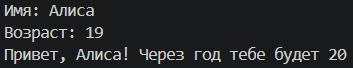
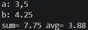
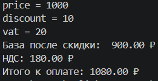
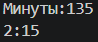
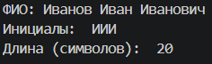

# Лабораторная 1
## Задание 1
### Ввод: 2 строки - имя(строка) и возраст(целое число). Вывод: Фраза + Имя + возраст + 1
```python
 name_ = input('Имя: ')
age_ = int(input('Возраст: '))

if name_ in '0123456789.,': raise SyntaxError('Имя не может содержать числа.')
if age_ < 0: raise ValueError('Введите возраст больший нуля.')

print('Привет, ', name_, '!',' Через год тебе будет ',age_ + 1,sep='')
```


## Задание 2
### Ввод: два вещественных числа, принимается запятая. Вывод: сумма и среднее арифмитическое
```python
a = input('a: ')
b = input('b: ')

a = float(a.replace(',','.'))
b = float(b.replace(',','.'))

summa = a + b
avg_ = (a + b)/2

print('sum=',f'{summa:.2f}','avg=',f'{avg_:.2f}')
```


## Задание 3
### Ввод: три вещественных числа - цена, процент скидки и процент налога. Вывод: три числа - база после скидки, НДС и итоговая цена
```python
price_ = float(input('price = '))

if price_ <= 0: raise ValueError('Цена не может быть меньше или равна 0.') 

discount_ = float(input('discount = '))

if discount_ > 100: raise ValueError('Скидка не может быть больше 100%') 

vat_ = float(input('vat = '))

if vat_ > 100: raise ValueError('Процент налога не может быть больше 100%')

base = price_ * (1 - discount_/100)
vat_amount = base * (vat_/100)
total = base + vat_amount

print('База после скидки: ',f'{base:.2f}','₽')
print('НДС:',f'{vat_amount:.2f}','₽')
print('Итого к оплате:',f'{total:.2f}','₽')
```


## Задание 4
### Ввод: число - количество минут. Вывод: время в формате чч:мм
```python
minutes_ = int(input('Минуты:'))

if minutes_ <= 0: raise ValueError('Введите количество минут большее 0.')

def hours(n):
    if minutes_ >= 60:
        hours = minutes_ // 60
        mints_ = minutes_ - (hours * 60)
    if minutes_ <= 59:
        hours = 0
        mints_ = minutes_
    time_ = str(hours) + ':' + str(mints_)
    return time_
print(hours(minutes_))
```


## Задание 5
### Ввод: ФИО одной строкой (принимается написание строчными буквами в том числе). Вывод: инициалы заглавными буквами и количество символов ФИО без лишних пробелов
```python
FIO = input('ФИО: ')
if FIO in '0123456789!@#$%^&*()_+={}[]":;<>,.?/№`~': raise TypeError('Имя не должно содержать лишние символы.')

letters_ = ''
FIO_No_Space = FIO.split()
count_space = len(FIO_No_Space) - 1
count_words = len(FIO_No_Space)

lenFIO = 0
for i in FIO_No_Space:
    lenFIO += len(i)

for i in FIO_No_Space:
    letters_ += i[0]

print('Инициалы: ', letters_.upper())
print('Длина (символов): ', lenFIO + count_space)
```

